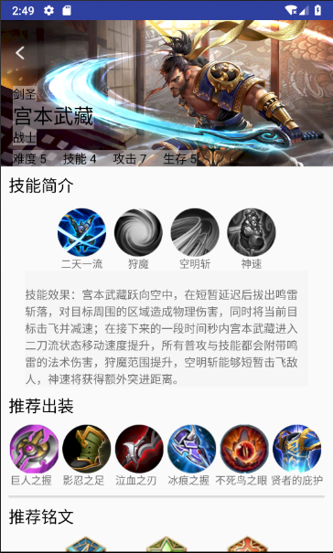
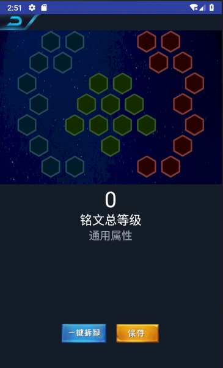
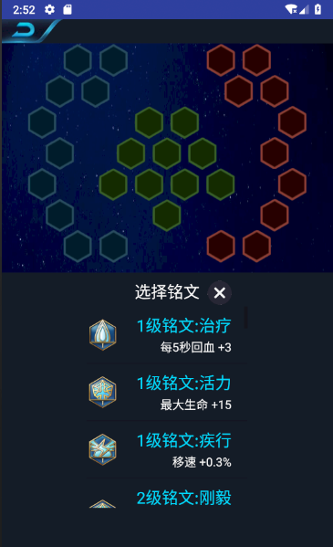
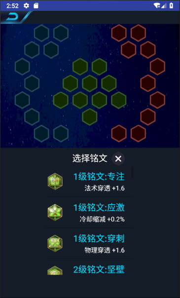
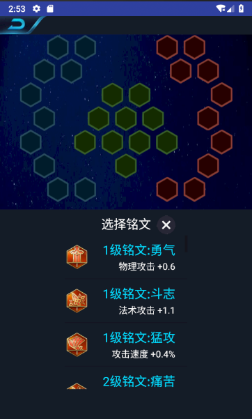
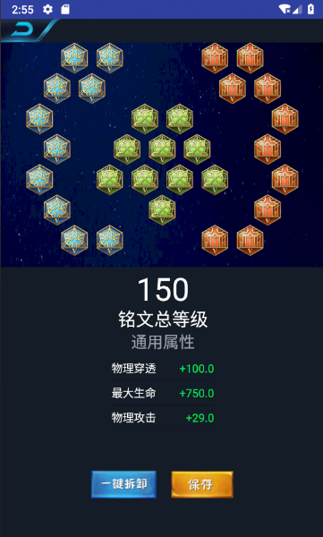
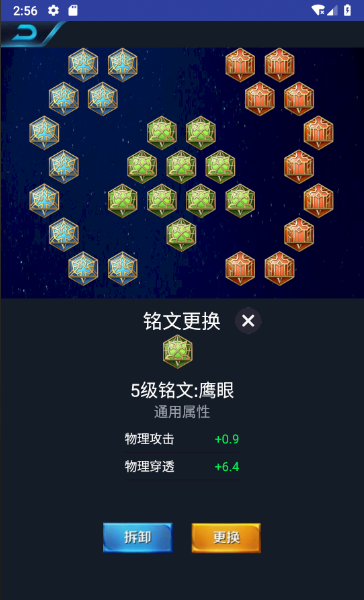

# 中山大学数据科学与计算机学院本科生实验报告
## （2018年秋季学期）
| 课程名称 | 手机平台应用开发 |   任课老师   |       郑贵锋       |
| :------: | :--------------: | :----------: | :----------------: |
|   年级   |       16级       | 专业（方向） |      软件工程      |
|   学号   |     16340031     |     姓名     |        陈涛        |
|   电话   |   136****3471    |    Email     | bz20100405@163.com |
| 开始日期 |     11月4日      |   完成日期   |      11月5日       |

---

## 一、实验题目
1. 王者荣耀盒子

---

## 二、实现内容
1. 铭文模拟功能
2. 详情页面逻辑，部分UI

---

## 三、课堂实验结果
### (1)实验截图
  
  
  
  
  
  
  
  

### (2)实验步骤以及关键代码
**英雄详情页面**

### 实验步骤
    1. 实现逻辑部分
    2. 完善UI部分

### 关键代码
1. 如何让ImageView中的图片自适应手机屏幕大小，而不会伸缩图片破坏图片效果？

scaleType设置为centerCrop,作用为: 以原图填满ImageView为目的，如果原图size大于ImageView的size，则与center_inside一样，按比例缩小，居中显示在ImageView上。如果原图size小于ImageView的size，则按比例拉升原图的宽和高，填充ImageView居中显示。

在这里，我们设置宽度为match_parent，与屏幕等宽，高度就会根据图片尺寸自动调整，使得图片比例和效果不受影响。
```
<ImageView
            android:id="@+id/skin"
            android:layout_width="match_parent"
            android:layout_height="wrap_content"
            android:scaleType="centerCrop"
            android:adjustViewBounds="true"/>
```
2. 如何让两个组件垂直对齐？

可以使用ConstraintLayout，但需要注意的是，作为参照的组件的宽度应该大于其他的组件，否则其他组件会显示不全。
```
app:layout_constraintLeft_toLeftOf="@id/skillName6"
app:layout_constraintRight_toRightOf="@id/skillName6"
```

3. 如何设置背景的透明度？

使用setBackgroundColor， 其中第一个参数为透明度，范围为0-255，0代表完全透明，255代表不透明
```
view.setBackgroundColor(Color.argb(100, 246,246, 246));
```

4. 如何将bitmap变灰？

setRotat(int axis，float degree）函数可以设置色调，参数axis用0、1、2代表red、Green、Blue三种颜色，参数degree表示需要处理的值。setSaturation(float sat）设置颜色饱和度，参数表示饱和度值，参数为0就是灰色头像了。setScale(foat lum,float lum,float lum,1)设置亮度，当lum为0时，图片就变为黑色。postConcat()方法将矩阵效果混合，从而叠加处理效果。

```
    public Bitmap setBitmap(Bitmap btm,float mHue,float mStauration ,float mLum){
        ColorMatrix colorMatrix =new ColorMatrix();
        colorMatrix.setRotate(0, mHue);
        colorMatrix.setRotate(1, mHue);
        colorMatrix.setRotate(2, mHue);
        ColorMatrix colorMatrix1 =new ColorMatrix();
        colorMatrix1.setSaturation(mStauration);
        ColorMatrix colorMatrix2 =new ColorMatrix();
        colorMatrix2.setScale(1,1,1,1);
        ColorMatrix colorMatrixs =new ColorMatrix();
        colorMatrixs.postConcat(colorMatrix);
        colorMatrixs.postConcat(colorMatrix1);
        colorMatrixs.postConcat(colorMatrix2);
        Bitmap bitmap = Bitmap.createBitmap(btm.getWidth(), btm.getHeight(), Bitmap.Config.ARGB_8888);
        final Paint paint =new Paint();
        paint.setAntiAlias(true);
        Canvas canvas =new Canvas(bitmap);
        paint.setColorFilter(new ColorMatrixColorFilter(colorMatrixs));
        canvas.drawBitmap(btm,0,0, paint);
        retu
```

5. json的解析

解析JSONArray   ["a", "b", "c"]
```
try {
	JSONArray jsonArray = new JSONArray(json);
	for(int i = 0; i < jsonArray.length(); i++)  {
    	String equip_name = jsonArray.getString(i);
    	// ...
    }
} catch (Exception e) {
	System.out.print(e.getMessage());
}
```
解析JSONObject   {"a":"1", "b":"2"}
```
try {
	JSONObject jsonObject = new JSONObject(json);
    Iterator p = jsonObject.keys();
    while(p.hasNext()) {
    	String type = p.next().toString();
        String epigraph_name = jsonObject.getString(type);
        // ...
    }
} catch (Exception e) {
	System.out.print(e.getMessage());
}
```
6. 如何调整bitmap的尺寸

使用matrix进行放缩
```
	Matrix matrix = new Matrix();
	matrix.postScale((float)0.5, (float)0.5);
	bitmap = Bitmap.createBitmap(bitmap, 0, 0, bitmap.getWidth(), 		bitmap.getHeight(), matrix,true);
```

**铭文模拟界面**

### 实验步骤
    1. 设计UI部分(主要是铭文展示部分)
    2. 完成逻辑部分

### 关键代码
1. 如何实现自定义形状的view？

（1） **自定义view类**
为自定义的view设置属性列表，如铭文的类型（名称）
```
<resources>
    <declare-styleable name="defineView">
        <attr name="epigraph_type" format="string"/>
    </declare-styleable>
</resources>
```

在自定义的view类中，需要定义这个属性的变量，并从xml的注册中获取，以及添加get，set函数，方便操作。
```
public class DefineView extends View {
    private String epigraph_type;
    
    public DefineView(Context context, AttributeSet attrs) {
        super(context, attrs);
        TypedArray type=context.obtainStyledAttributes(attrs, R.styleable.defineView);
        epigraph_type = type.getString(R.styleable.defineView_epigraph_type);
        init();
    }

    public void setEpigraph(String Epigraph) {
        epigraph_type = Epigraph;
    }

    public String getEpigraph_type() {
        return epigraph_type;
    }
    
```

在onDraw函数中完成view形状的设计。在canvas中完成绘画，使用path定义边界的路径（六边形），最后在将铭文的图片绘制进去。
```
protected void onDraw(Canvas canvas) {
        super.onDraw(canvas);
        init();  // 将铭文的图片给到bitmap变量
        mWidth = getWidth()/10;
        mHeight = getHeight()/10;

        // 计算中心点

        double radian30 = 30 * Math.PI / 180;

        if (paint == null) {
            paint = new Paint();
            paint.setAntiAlias(true);
            paint.setStyle(Paint.Style.FILL);
            paint.setAlpha(200);
        }

        Path path = new Path();
        path.moveTo(mWidth/2, 0);
        path.moveTo(mWidth, (float)(mWidth/2*Math.tan(radian30)));
        path.moveTo(mWidth, (float)(mHeight- mWidth/2*Math.tan(radian30)));
        path.moveTo(mWidth/2, mHeight);
        path.moveTo(0,(float)(mHeight- mWidth/2*Math.tan(radian30)));
        path.moveTo(0, (float)(mWidth/2*Math.tan(radian30)));
        path.close();

        canvas.drawPath(path, paint);

        Paint paintcontent = new Paint();
        Matrix matrix=new Matrix();
        canvas.drawBitmap(bitmap, matrix, paintcontent);
    }
```
（2）**自定义viewGroup类，用于组织view**

在onLayout函数中定义Group中所有view的位置,使用layout函数，参数分别为left, top, right, bottom。基准为viewGroup的左上角，意义为view的边界。所以为了恰好为view的范围（否则点击事件不准确），需要逐个调整，比较繁琐的方法，如：
```
view0.layout(SPACE+viewWidth/factor, 0, viewWidth*2/factor+SPACE, viewHeight/factor+SPACE);
```
实现继承的onMeasure函数
```
    protected void onMeasure(int widthMeasureSpec, int heightMeasureSpec) {
        // TODO Auto-generated method stub
        super.onMeasure(widthMeasureSpec, heightMeasureSpec);

        int width = MeasureSpec.getSize(widthMeasureSpec);
        int height = MeasureSpec.getSize(heightMeasureSpec);
        setMeasuredDimension(width, height);
        //设置View 的高宽
        for (int i = 0; i < getChildCount(); i++) {
            View child = getChildAt(i);
            child.measure(viewWidth,viewHeight);
        }
    }
```
2. 如何更新view的绘制？

在修改view的属性后，使用invalidate()函数重新绘制view，达到更新效果
```
    public void click(String s) {
    	current.setEpigraph(s);
    	current.invalidate();
   		go("first", "");
    }
```

3. 如何解决java浮点数相加不精确的问题？

使用BigDecimal变量进行运算, 之后再将运算结果转为需要的类型（如toString()）
```
BigDecimal a1 = new BigDecimal(String.valueOf(a));
                                BigDecimal b1 = new BigDecimal(String.valueOf(b));
                                BigDecimal d = a1.add(b1);
attr_map.put(attr_name, "+"+d.toString()+"%");
```
### (3)实验遇到的困难以及解决思路

---

## 四、课后实验结果
---

## 五、实验思考及感想
```

```

---