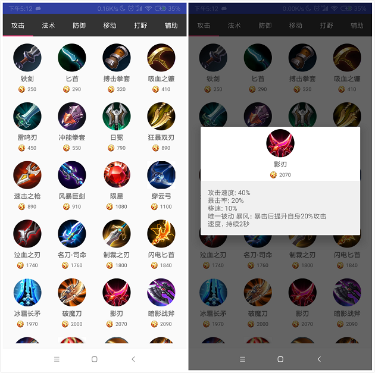

# Group26 期中项目用户说明文档
## （2018年秋季学期）
| 课程名称 | 手机平台应用开发 |   任课老师   |       郑贵锋       |
| :------: | :--------------: | :----------: | :--------------: |
|   年级   |       16级       | 专业（方向） |      软件工程      |
| 开始日期 |     11月8日      |   完成日期   |      11月15日       |
---

### 项目名称
#### **王者荣耀英雄大全**
---

### 项目成员

| 学号 | 姓名 | 组内角色 |
| :------: | :--------------: | :----------: |
| 16340030 | 陈斯敏 | 组长 |
| 16340031 | 陈涛 | 组员 |
| 16340026 | 陈谱一 | 组员 |

---
### 项目说明
该APP主要是用于帮助王者荣耀玩家获取相关英雄信息，了解英雄攻略，实时模拟铭文方案，查看装备详细信息的一个游戏辅助工具。同时，该工具具有分类、收藏等功能，方便用户进行选择和使用，界面优良，更有酷炫音频、英雄高清图片资源等。

### 功能介绍
#### 一、主页面
* 打开APP即进入主页面，采用动态背景及酷炫音乐播放（音乐播放可点击右上角图标取消播放）
  
  

* 点击主页面按钮会进入其他页面

#### 二、英雄列表页面
* 点击主页面的“我的英雄”按钮进入该页面，该页面会以表格形式显示用户所收藏的英雄，同时，对这些英雄的战斗属性进行了分类，便于用户按类查找，可进行滑动切换tab页。
  
  

* 长按英雄可以将英雄从收藏列表移除。
  
  

* 点击每个tab页面最后的“添加英雄”，可以添加该tab页面对应的战斗属性的未添加英雄，点击弹框中的任一英雄，可以添加至收藏列表。
  
  

* 点击任一tab页面的任一英雄，可以进入对应英雄的详情页面。

#### 三、英雄详情页面
* 点击我的英雄页面任一英雄进入该页面，这里以英雄“李白”作为例子，该页面上方是该英雄的图片，图片上会有相关信息（包括英雄外号，名称，战斗属性，难度，技能等），接下来，从上到下是技能介绍，推荐出装，推荐铭文以及玩法技巧等。
  
  

* 点击技能图标会切换技能，图标颜色和技能介绍也会相应改变。

  

* 点击推荐出装的任一装备，会弹出该装备的详细信息。

  

#### 四、装备详情页面
* 点击主页面的“装备大全”按钮进入该页面，该页面会以表格形式显示所有装备，同时，对这些英雄的战斗属性进行了分类，便于用户按类查找，可进行滑动切换tab页。

  
  
* 点击任意装备可查看该装备的详细信息。

  

#### 五、铭文模拟页面
* 点击主页面的“铭文搭配”按钮进入该页面，点击任意颜色的铭文框可选择对应颜色种类的铭文进行装卸，铭文按等级排序。
  
  

* 搭配铭文之后可以查看该铭文方案的总等级与加成。

  

* 点击保存按钮可以保存当前搭配方案，下次进入会自动加载该方案并显示与页面上。