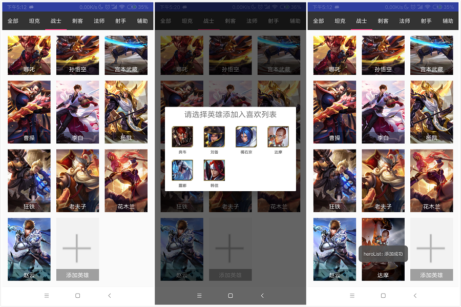
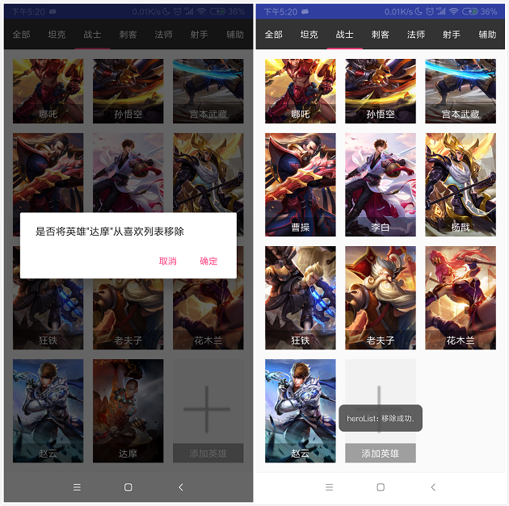
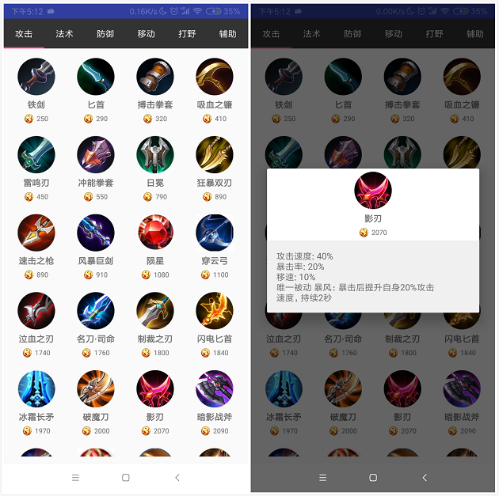
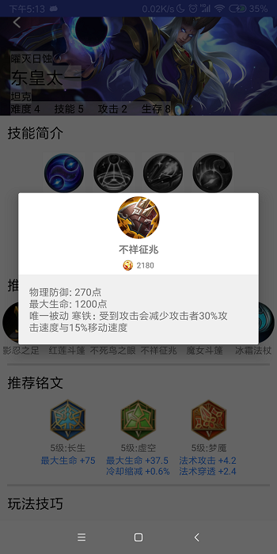

# 中山大学数据科学与计算机学院本科生实验报告
## （2018年秋季学期）
| 课程名称 | 手机平台应用开发 |   任课老师   |       郑贵锋       |
| :------: | :--------------: | :----------: | :----------------: |
|   年级   |       16级       | 专业（方向） |      软件工程      |
|   学号   |     163400310     |     姓名     |        陈涛斯敏        |
|   电话   |   15917173057    |    Email     | 2540740154@qq.com |
| 开始日期 |     11月8日      |   完成日期   |      11月15日       |

---

## 一、实验题目
1. 王者荣耀盒子

---

## 二、实现内容
1. 数据获取——使用python的bs4进行脚本编写和数据爬取并存入数据库。
2. 我的英雄界面UI和逻辑实现（tab滑动列表，英雄的增加和删除）。
3. 装备大全界面UI和逻辑实现（tab滑动列表，点击装备获取详细信息）。
4. 英雄详情页面点击装备弹出详细信息。
5. 获取相关信息的数据库代码实现。

---

## 三、实验结果
### (1)实验截图
* 在主页面点击我的英雄进入英雄列表，按照英雄类型进行tab分页：
  
* 英雄列表页面，点击添加，从未添加列表中选择英雄添加:
  
* 英雄列表页面长按英雄，删除我喜欢的英雄:
  
* 在主页面点击装备大全，进入装备页面，按照装备类型进行tab分页，点击装备获取装备详情：
  
* 在英雄详情页面点击出装中的装备，获取装备详情：
  


### (2)实验步骤以及关键代码
## **网页爬取数据库信息**

### 实现步骤
* 网页爬取解析，获得相关信息
* 根据解析内容获取uri爬取图片
* 将信息和图片存入数据库中

### 关键代码
#### 1. 网页爬取选用python的bs4，相对较为繁琐.
* 此处给出爬取攻击，法术攻击，生存能力等的属性值的代码作为例子（其余不作赘述）：
```python
# readhtmlfile为一个函数获取主页面（用以解析得到所有英雄详情页面url）
content = readhtmlfile()
soup2 = BeautifulSoup(content, "html.parser", from_encoding="gbk")

li = soup2("a")
for l in li:
    # 爬取的是移动端的页面
    url = "http://pvp.qq.com/web201605/" + l["href"].replace("/", "/m/").replace("shtml", "html")
    req = requests.get(headers=header, url=url)

    req.encoding = "gbk"
    soup = BeautifulSoup(req.content, "html.parser")
    name = soup.find(attrs={"class": "hero-name"}).text
    l2 = soup.find(attrs={"class": "cover-list c"})("li")

    print name
    # 进行解析并使用正则式获取对应数值
    survival = re.findall("\d+", l2[0]("span")[0]["class"][2])[1]
    attack =  re.findall("\d+", l2[1]("span")[0]["class"][2])[1]
    skill =  re.findall("\d+", l2[2]("span")[0]["class"][2])[1]
    difficulty = re.findall("\d+", l2[3]("span")[0]["class"][2])[1]
    # 存入数据库
    sql = "update heroinfo set survival = " + survival + ", attack = " +  \
            attack + ", skill = " + skill + ", difficulty = " + difficulty + \
            " where name = '" + name + "'";
    h_cursor.execute(sql)
    h_db.commit()
```
#### 2. 利用图片的url得到对应的英雄图片保存在本地
* 此处使用的是urllib库的urlretrieve函数，此处贴出获取英雄大图标的函数的：
  ```python
    content = readhtmlfile()
    soup2 = BeautifulSoup(content, "html.parser", from_encoding="gbk")

    li = soup2("a")
    for l in li:
        url = "http://pvp.qq.com/web201605/" + l["href"].replace("/", "/m/").replace("shtml", "html")
        req = requests.get(headers=header, url=url)
        req.encoding = "gbk"
        soup = BeautifulSoup(req.content, "html.parser")
        name = soup.find(attrs={"class": "hero-name"}).text
        print l["href"].split("/")[1].split(".")[0],name
        ID = l["href"].split("/")[1].split(".")[0]
        url = "http://game.gtimg.cn/images/yxzj/img201606/skin/hero-info/" + ID + "/" + ID + "-mobileskin-1.jpg"
        # 根据URI保存图片并下载到本地
        urllib.urlretrieve(url = url, filename = 'images/heros/big_icon/' + name + ".jpg")
        print 'download %s.jpg'%(name)
  ```
#### 3. 存入sqlite数据中，这里使用的是python3的sqlite3库
* 数据库的连接如下：
  ```python
  import sqlite3
  s_db = sqlite3.connect('kingofglory.db')
  s_cursor = s_db.cursor()
  ```
* 数据库的插入如下，此处贴出插入铭文信息的相应代码作为例子：
  ```python
  for item in os.listdir("images\\rune"):
    if (item.find(name) != -1):
        print(name,item)
        # 读取图片
        fp = open("images\\rune\\" + item, 'rb')
        rune_iamge = fp.read()
        # 执行插入代码
        s_cursor.execute("INSERT INTO rune(name, color, level, category, riskAttr, normalAttr, rune_image) VALUES (?,?,?,?,?,?,?)", 
            (name, color, level, category, riskAttr, normalAttr, rune_iamge))
        s_db.commit()
  ```

## **装备大全列表界面**

### 实验步骤
* 实现UI部分
* 实现逻辑部分

### 关键代码
#### 1. 实现页面的tab效果，即触屏滑动切换页面，此处我使用的是ViewPager和TabLayout合并使用的到的效果：
* 首先是activity_equip.xml布局，比较简单，就是上述的那两个控件：
  ```xml
    <LinearLayout xmlns:android="http://schemas.android.com/apk/res/android"
        android:layout_width="match_parent"
        android:layout_height="match_parent"
        android:orientation="vertical"
        xmlns:app="http://schemas.android.com/apk/res-auto">
        <android.support.design.widget.TabLayout
            android:id="@+id/sliding_tabs"
            android:layout_width="match_parent"
            android:layout_height="wrap_content"
            app:tabTextColor="#FFFFFF"
            android:background="#333333"
            />
        <android.support.v4.view.ViewPager
            android:id="@+id/viewpager"
            android:layout_width="match_parent"
            android:layout_height="wrap_content"
            />
    </LinearLayout>
  ```
* EquipActivity 将两者合并起来
  ```java
    private ViewPager mViewPager;
    private TabLayout mTabLayout;
    private FragmentManager mFragmentManager;

    @Override
    protected void onCreate(Bundle savedInstanceState) {
        super.onCreate(savedInstanceState);
        setContentView(R.layout.activity_equip);

        mTabLayout = findViewById(R.id.sliding_tabs);
        mViewPager = findViewById(R.id.viewpager);
        mFragmentManager = getSupportFragmentManager();
        //为viewpager设置适配器
        mViewPager.setAdapter(new EquipDetailPageAdapter(EquipActivity.this, mFragmentManager));
        // 绑定TabLayout和ViewPager
        mTabLayout.setupWithViewPager(mViewPager);
    }
  ```
* 然后便是适配器EquipDetailPageAdapter，因为其实滑动切换页面是需要多个Fragment来实现的，所以我们需要为这几个Fragment设置布局和逻辑等。但因为我们此处多个Fragment的样式和逻辑是相似的（列表式页面），所以代码可复用,这里的EquipDetailPageAdapter就是来管理多个Fragment的适配器：
  ```java
  public class EquipDetailPageAdapter extends FragmentPagerAdapter {

    private static int PAGE_COUNT;//表示要展示的页面数量
    String[] type = {"攻击", "法术", "防御", "移动", "打野", "辅助"};
    private Context mContext;

    public EquipDetailPageAdapter(Context context, FragmentManager fm) {
        super(fm);
        this.mContext = context;
        PAGE_COUNT = 6;
    }

    @Override
    public Fragment getItem(int position) {
        return EquipInfoFragment.newInstance(position);
    }

    @Override
    public int getCount() {
        return PAGE_COUNT;
    }

    @Override
    public CharSequence getPageTitle(int position) {//设置标题
        if (position < 6)
            return type[position];
        else
            return null;
    }
  }
  ```
* EquipInfoFragment用以根据type（装备类型）生成相应的Fragment，相应的newInstance函数也可以在上面的适配器实现：
  ```java
  public class EquipInfoFragment extends Fragment {
    private static final String ARG_PARAM = "param";
    private int mParam;//用来表示当前需要展示的是哪一页
    public EquipInfoFragment() {
        // Required empty public constructor
    }
    public static EquipInfoFragment newInstance(int param) {
        EquipInfoFragment fragment = new EquipInfoFragment();
        Bundle args = new Bundle();
        args.putInt(ARG_PARAM, param);
        fragment.setArguments(args);
        return fragment;
    }

    @Override
    public void onCreate(Bundle savedInstanceState) {
        super.onCreate(savedInstanceState);
        if (getArguments() != null) {
            mParam = getArguments().getInt(ARG_PARAM);
        }
    }
    ...
  ```
* 然后是设置每个页面的gridView，gridView也需要相应的适配器，也就是我们会在Fragment的适配器中对其gridView再进行设置适配器：
  ```java
    @Override
    public View onCreateView(LayoutInflater inflater, ViewGroup container,
                             Bundle savedInstanceState) {
        // Inflate the layout for this fragment
        View view = inflater.inflate(R.layout.equip_list, container, false);
        GridView gridView = view.findViewById(R.id.gridView);

        //根据mParam来判断当前展示的是哪个类型的出装，获取相应的gridView的适配器。
        String[] type = {"攻击", "法术", "防御", "移动", "打野", "辅助"};
        gridView.setAdapter(new EquipListViewAdapter(view.getContext(), type[mParam]));
        gridView.setOnItemClickListener(new AdapterView.OnItemClickListener() {
            @Override
            public void onItemClick(AdapterView<?> parent, final View view, int position, long id) {
                ...
            }
        });
        return view;
    }
  ```
#### 2. 装备列表页面GridView的实现
* 此处我使用的是gridView，xml页面只是单纯一个FrameLayout包着一个gridView而已：
  ```xml
  <FrameLayout xmlns:android="http://schemas.android.com/apk/res/android"
    android:layout_width="match_parent"
    android:layout_height="match_parent">

    <GridView
        android:id="@+id/gridView"
        android:layout_width="match_parent"
        android:layout_height="wrap_content"
        android:scrollbars="none"
        android:layout_margin="10dp"
        android:numColumns="4"
        android:verticalSpacing="10dp"
        android:horizontalSpacing="10dp"/>

  </FrameLayout>
  ```
* gridView的适配器的实现，这个与之前PersonalProject2中listView的适配器实现相似，此处不过多赘述，此处贴出关键函数getView的实现：
  ```java
    public class EquipListViewAdapter extends BaseAdapter {
        private List<EquipItem> list;
        private Context context;

        public EquipListViewAdapter(Context _context, String type) {
            this.context = _context;
            list = myDB.getInstance().get_equip_list(type);
        }

        @Override
        public View getView(final int i, View view, ViewGroup viewGroup) {
            // 新声明一个View变量和ViewHoleder变量,ViewHolder类在下面定义。
            View convertView ;
            ViewHolder viewHolder;
            // 当view为空时才加载布局，否则，直接修改内容
            if (view == null) {
                // 通过inflate的方法加载布局，context需要在使用这个Adapter的Activity中传入。
                view = LayoutInflater.from(context).inflate(R.layout.equip_item, null);
                viewHolder = new ViewHolder();
                viewHolder.equipName = view.findViewById(R.id.equip_name);
                viewHolder.equipPrice = view.findViewById(R.id.equip_price);
                viewHolder.equipIcon = view.findViewById(R.id.equip_icon);
                view.setTag(viewHolder); // 用setTag方法将处理好的viewHolder放入view中
                convertView = view;
            } else { // 否则，让convertView等于view，然后从中取出ViewHolder即可
                convertView = view;
                viewHolder = (ViewHolder) convertView.getTag();
            }
            final EquipItem equip = list.get(i);
            // 从viewHolder中取出对应的对象，然后赋值给他们
            viewHolder.equipName.setText(equip.getName());
            viewHolder.equipPrice.setText(equip.getPrice());
            viewHolder.equipIcon.setImageBitmap(equip.getImage());
            // 将这个处理好的view返回
            return convertView;
        }

        ...

        private class ViewHolder {
            public TextView equipName;
            public TextView equipPrice;
            public ImageView equipIcon;
        }
    }
  ```
* 初始化时需要从数据库获取相应的类型的装备列表，此处我们看一下myDB中这一块的获取数据的函数(其中EquipItem是用来存储装备数据的一个类)：
  ```java
    public List<EquipItem> get_equip_list(String type) {
        String sql = String.format("SELECT * FROM equip WHERE category = '%s' ORDER BY price", type);
        Cursor cursor = m_db.rawQuery(sql, null);

        List<EquipItem> list = new ArrayList<>();
        while (cursor.moveToNext()) {
            EquipItem equip= new EquipItem();
            equip.setName(cursor.getString(cursor.getColumnIndex("name")));
            equip.setPrice(""+cursor.getInt(cursor.getColumnIndex("price")));
            byte[] data = cursor.getBlob(cursor.getColumnIndex("equip_icon"));
            Bitmap image = BitmapFactory.decodeByteArray(data, 0, data.length);
            equip.setImage(image);
            list.add(equip);
        }
        cursor.close();
        return list;
    }
  ```
#### 3. 实现现在点击装备时弹出的dialog具有相应布局，显示图片和文字等信息。
* 设置dialog的xml布局文件：
  ```xml
  <LinearLayout xmlns:android="http://schemas.android.com/apk/res/android"
    android:layout_width="match_parent"
    android:layout_height="match_parent"
    android:background="#00cccccc"
    android:orientation="vertical">

    <ImageView
        android:id="@+id/equip_icon"
        android:shape="rectangle"
        android:layout_width="60dp"
        android:layout_height="60dp"
        android:layout_margin="5dp"
        android:layout_gravity="center_horizontal"/>

    <TextView
        android:id="@+id/equip_name"
        android:layout_width="wrap_content"
        android:layout_height="wrap_content"
        android:layout_gravity="center_horizontal"
        android:textStyle="bold"
        android:textSize="14sp"/>

    <LinearLayout
        android:layout_gravity="center_horizontal"
        android:padding="5dp"
        android:layout_width="wrap_content"
        android:layout_height="wrap_content">
        <ImageView
            android:src="@drawable/gold_coin"
            android:layout_width="16dp"
            android:layout_height="16dp"
            android:layout_gravity="center_vertical"
            android:layout_marginRight="4dp"/>
        <TextView
            android:id="@+id/equip_price"
            android:layout_width="wrap_content"
            android:layout_height="wrap_content"
            android:layout_gravity="center_vertical"
            android:textSize="11dp"/>
    </LinearLayout>

    <TextView
        android:id="@+id/equip_detail"
        android:padding="15dp"
        android:background="#F0F0F0"
        android:layout_width="match_parent"
        android:layout_height="wrap_content" />
  </LinearLayout>
  ```
* dialog使用View.inflate来设置对应的xml布局文件：
  ```java
    final AlertDialog.Builder dialog = new AlertDialog.Builder(view.getContext());
    View dialogView = View.inflate(view.getContext(), R.layout.equip_dialog, null);
    String equip_name = ((TextView)view.findViewById(R.id.equip_name)).getText().toString();

    EquipItem equip = myDB.getInstance().get_equip(equip_name);

    TextView Name = dialogView.findViewById(R.id.equip_name);
    Name.setText(equip_name);
    TextView Price = dialogView.findViewById(R.id.equip_price);
    Price.setText((equip.getPrice()));
    ImageView Icon = dialogView.findViewById(R.id.equip_icon);
    Icon.setImageBitmap(equip.getImage());
    TextView Detail = dialogView.findViewById(R.id.equip_detail);
    Detail.setText(equip.getBase_attr()+'\n'+equip.getEquip_skill());

    dialog.setView(dialogView);
    dialog.show();
  ```
## **我的英雄列表界面**

### 实验步骤
* 实现UI部分
* 实现逻辑部分

### 关键代码
#### 1. 实现tab滑动切换英雄类型页面，即英雄列表界面详情
* 逻辑实现部分与装备页面的实现部分是相似的，只不过是gridView中item的样式略有不同，此处我们来看一下如何在布局文件中实现在图片上面显示文字，此处我使用的是相对布局，ImageView和TextView在xml中的顺序有关，先进行ImageView的声明，然后声明TextView，就可以实现文字是在ImageView之上（顺序反过来则会导致图片将文字覆盖）。
  ```xml
  <RelativeLayout xmlns:android="http://schemas.android.com/apk/res/android"
    android:layout_width="match_parent"
    android:layout_height="match_parent"
    >
    <ImageView
        android:id="@+id/heroIcon"
        android:layout_width="match_parent"
        android:layout_height="wrap_content"
        android:layout_centerHorizontal="true"
        android:scaleType="centerCrop"
        android:adjustViewBounds="true"
        />
    <TextView
        android:id="@+id/heroName"
        android:layout_width="match_parent"
        android:layout_height="wrap_content"
        android:text=""
        android:textSize="15sp"
        android:textColor="#FFFFFF"
        android:background="#e0000000"
        android:gravity="center_horizontal"
        android:layout_alignParentBottom="true"
        android:padding="5dp"
        />
  </RelativeLayout>
  ```
* 设置文字背景透明度，使得每个item整体看起来比较美化协调(此处是在对应的GridView的适配器代码中进行设置，利用ImageView的setAlpha函数)：
  ```java
  viewHolder.heroName.getBackground().setAlpha(100);
  ```
#### 2. 实现点击英雄列表中GridView的特殊item“添加英雄”，弹出弹框并在弹框中显示新的GridView，新的GridView显示未添加的英雄的列表。
* 此处实现较为麻烦，是写在英雄列表的GridView的适配器的点击事件中，dialog的xml如下(没错，只是相当简单的一个TextView+一个GridView)：
  ```xml
  <LinearLayout
    xmlns:android="http://schemas.android.com/apk/res/android"
    android:layout_width="match_parent"
    android:layout_height="match_parent"
    android:layout_marginTop="80dp"
    android:layout_marginBottom="80dp"
    android:orientation="vertical">

    <TextView
        android:id="@+id/title"
        android:text="请选择英雄添加入喜欢列表"
        android:textSize="20dp"
        android:padding="5dp"
        android:textAlignment="center"
        android:layout_width="match_parent"
        android:layout_height="wrap_content" />

    <GridView
        android:id="@+id/gridView"
        android:layout_width="match_parent"
        android:layout_height="wrap_content"
        android:scrollbars="none"
        android:layout_margin="8dp"
        android:numColumns="4"
        android:verticalSpacing="8dp"
        android:horizontalSpacing="8dp"/>

  </LinearLayout>
  ``` 
* 然后，英雄列表的GridView的适配器的点击事件中，获取上面xml的GridView并设置适配器，然后我们需要对这个GridView的设配器再次定义相应的点击事件（显得有些臃肿，但是不得已这么实现）。
  ```java
    gridView.setOnItemClickListener(new AdapterView.OnItemClickListener() {
        @Override
        public void onItemClick(AdapterView<?> parent, final View view, int position, long id) {
            String hero_name = ((TextView)view.findViewById(R.id.heroName)).getText().toString();
            if (hero_name.equals("添加英雄")) {
                final AlertDialog.Builder dialogBuilder = new AlertDialog.Builder(view.getContext());
                final View dialogView = View.inflate(view.getContext(), R.layout.dialog, null);
                GridView gridView1 = dialogView.findViewById(R.id.gridView);
                final HeroDialogListViewAdapter heroDialogListViewAdapter =
                        new HeroDialogListViewAdapter(dialogView.getContext(), type[mParam]);
                gridView1.setAdapter(heroDialogListViewAdapter);
                if (heroDialogListViewAdapter.getCount() == 0) {
                    TextView title = dialogView.findViewById(R.id.title);
                    title.setText("无可添加的英雄");
                    dialogView.findViewById(R.id.gridView).setVisibility(View.GONE);
                    dialogBuilder.setView(dialogView).create().show();
                    return;
                }
                dialogBuilder.setView(dialogView);
                final AlertDialog dialog = dialogBuilder.create();
                gridView1.setOnItemClickListener(new AdapterView.OnItemClickListener() {
                    @Override
                    public void onItemClick(AdapterView<?> parent, View view, int position, long id) {
                        ...
                    }
                });
                dialog.show();
            } else {
                // 跳转到详情页面
                ...
            }
        }
    });
  ```
* 设置点击dialog中GridView的条目，增加到喜欢列表中。这个的实现需要考虑较多东西，首先，是数据库的修改，这里我给数据库中每个英雄条目增添了相应的islike字段（值为0或1，1代表添加入喜欢列表），所以涉及喜欢列表的增删，我们需要修改该字段值。
  同时，还存在另外一个问题，我们修改了这个列表中的英雄，那么，其他列表的英雄也需要相应修改（例如，我增加了“全部”列表中的一个英雄，那么，如果这个英雄是“坦克”类型的，我还需要在“坦克”列表中增加该英雄，所以此时我们进行修改还需要考虑其他列表的值）。
  修改数据库的相应函数
  ```java
    //数据库中update是否收藏字段的值
    public void update_like_hero(String hero_name, int islike) {
        String sql = String.format(
                Locale.CHINA,
                "UPDATE hero set islike = %d where name = \"%s\"", islike, hero_name);
        m_db.execSQL(sql);
    }
  ```
  增加英雄的点击事件，位于上面dialog的GridView的适配器的点击函数中，此处如何更新其他tab页的列表的问题我们放在思考与问题中简要说明：
  ```java
    final AlertDialog dialog = dialogBuilder.create();
    gridView1.setOnItemClickListener(new AdapterView.OnItemClickListener() {
        @Override
        public void onItemClick(AdapterView<?> parent, View view, int position, long id) {
        TextView heroName = view.findViewById(R.id.hero_name);
        String hero_name = heroName.getText().toString();
        Hero hero = (Hero)heroDialogListViewAdapter.getItem(position);
        heroListViewAdapter.addItem(hero);
        if (type[mParam].equals("全部")) {
            for (int i = 0;i < type.length; i++) {
                if (hero.getHeroRole().equals(type[i])) {
                    ((HeroInfoFragment)HeroInfoFragment.getFragmentList().get(i))
                            .getAdapter().addItem(hero);
                    break;
                }
            }
        } else {
            ((HeroInfoFragment)HeroInfoFragment.getFragmentList().get(0))
                    .getAdapter().addItem(hero);
        }
        myDB.getInstance().update_like_hero(hero_name, 1);
        heroDialogListViewAdapter.removeItem(position);
        Toast.makeText(view.getContext(), "添加成功", Toast.LENGTH_SHORT).show();
        dialog.cancel();
        }
    });
    dialog.show();
  ```
#### 3. 实现点击英雄列表中GridView的item，跳转到相应的详情页面。长按英雄列表中的item从收藏列表移除该英雄。
* 跳转到详情页面，传递该英雄名称，然后详情页面拿到该名称便去数据库获取详细信息，避免传参的冗余。
  ```java
    // 跳转到详情页面
    Intent intent = new Intent(view.getContext(), DetailActivity.class);;
    intent.putExtra("detail", hero_name);
    startActivityForResult(intent, 0);
  ```
  长按删除英雄（该英雄便会出现在未收藏列表中），同样的，涉及数据库的修改和其他tab页列表的更新。
  ```java
  gridView.setOnItemLongClickListener(new AdapterView.OnItemLongClickListener() {

        @Override
        public boolean onItemLongClick(AdapterView<?> parent, final View view,
                                        final int position, long id) {
            final AlertDialog.Builder dialog = new AlertDialog.Builder(view.getContext());
            TextView heroName = view.findViewById(R.id.heroName);
            final String hero_name = heroName.getText().toString();
            if (heroName.getText().equals("添加英雄")) {
                dialog.setMessage("请别瞎几把长按，谢谢配合");
                dialog.setPositiveButton("确定", new DialogInterface.OnClickListener() {
                    @Override
                    public void onClick(DialogInterface dialog, int which) {
                        dialog.cancel();
                    }
                });
                dialog.show();
                return true;
            }
            dialog.setMessage("是否将英雄\"" + hero_name +"\"从喜欢列表移除");
            dialog.setPositiveButton("确定", new DialogInterface.OnClickListener() {
                @Override
                public void onClick(DialogInterface dialog, int which) {
                    myDB.getInstance().update_like_hero(hero_name, 0);
                    Hero hero = (Hero) heroListViewAdapter.getItem(position);
                    if (type[mParam].equals("全部")) {
                        for (int i = 0;i < type.length; i++) {
                            if (hero.getHeroRole().equals(type[i])) {
                                ((HeroInfoFragment)HeroInfoFragment.getFragmentList().get(i))
                                        .getAdapter().removeItemByName(hero_name);
                                break;
                            }
                        }
                    } else {
                        ((HeroInfoFragment)HeroInfoFragment.getFragmentList().get(0))
                                .getAdapter().removeItemByName(hero_name);
                    }

                    heroListViewAdapter.removeItem(position);
                    Toast.makeText(view.getContext(), "移除成功.", Toast.LENGTH_SHORT).show();
                }
            });
            dialog.setNegativeButton("取消", null);
            dialog.create().show();
            return true;
        }
    });
  ```
## **英雄详情界面**

### 实验步骤
* 实现点击装备弹出弹框的逻辑部分

### 关键代码
#### 1. 点击出装中的任一装备弹出弹框，弹框显示装备详情.
* 该部分与装备大全的点击装备弹出详细信息的实现类似，此处我将其封装为一个函数，传入相应装备名称，查询数据库获取相应数据，弹出弹框显示相应数据。
  ```java
     // 根据装备名称输出dialog
    public void showEquipDialog(String equip_name) {
        final AlertDialog.Builder dialog = new AlertDialog.Builder(DetailActivity.this);
        View dialogView = View.inflate(DetailActivity.this, R.layout.equip_dialog, null);

        EquipItem equip = myDB.getInstance().get_equip(equip_name);

        TextView Name = dialogView.findViewById(R.id.equip_name);
        Name.setText(equip_name);
        TextView Price = dialogView.findViewById(R.id.equip_price);
        Price.setText((equip.getPrice()));
        ImageView Icon = dialogView.findViewById(R.id.equip_icon);
        Icon.setImageBitmap(equip.getImage());
        TextView Detail = dialogView.findViewById(R.id.equip_detail);
        Detail.setText(equip.getBase_attr()+'\n'+equip.getEquip_skill());

        dialog.setView(dialogView);
        dialog.show();
    }
   ```
* 数据库获取相应装备数据的函数如下所示：
  ```java
      public EquipItem get_equip(String name) {
        String sql = String.format("SELECT * FROM equip WHERE name = '%s'", name);
        Cursor cursor = m_db.rawQuery(sql, null);
        EquipItem equip = new EquipItem();
        if (cursor.moveToFirst()) {
            equip.setName(cursor.getString(cursor.getColumnIndex("name")));
            equip.setPrice(""+cursor.getInt(cursor.getColumnIndex("price")));
            String base_attr = cursor.getString(cursor.getColumnIndex("baseAttr"));
            base_attr = base_attr.replace("{", "").replace("}", "");
            base_attr = base_attr.replace("\"", "").replace(", ", "\n");
            equip.setBase_attr(base_attr);
            String equip_skill = cursor.getString(cursor.getColumnIndex("equipSkill"));
            equip_skill = equip_skill.replace("[", "").replace("]", "");
            equip_skill = equip_skill.replace("\"", "").replace(", 唯一被动", "\n唯一被动");
            equip.setEquip_skill(equip_skill);
            byte[] data = cursor.getBlob(cursor.getColumnIndex("equip_icon"));
            Bitmap image = BitmapFactory.decodeByteArray(data, 0, data.length);
            equip.setImage(image);
        }
        return equip;
    }
  ```

### (3)实验遇到的困难以及解决思路
* #### 问题1：如何使用已存在的数据库，因为之前实现的项目都是自己初始化创建，但是这次的代码需要自己爬取和整理好一份数据库拿来使用。
  **解决**： 我们采用的方案是将数据库文件放在assets文件夹中，然后在程序初始化时将该文件拷入相应目录并读取，相应的，第一次打开会比较慢，因为需要拷贝大约100MB左右的数据库文件，拷贝代码如下：
  ```java
      // 复制和加载区域数据库中的数据
    public String  CopySqliteFileFromRawToDatabases(String SqliteFileName) throws IOException {

        // 第一次运行应用程序时，加载数据库到data/data/当前包的名称/database/<db_name>

        File dir = new File("data/data/com.example.a17980.herolist/kingofglory.db");

        if (!dir.exists() || !dir.isDirectory()) {
            dir.mkdir();
        }

        File file = new File(dir, SqliteFileName);
        InputStream inputStream = null;
        OutputStream outputStream =null;

        //通过IO流的方式，将assets目录下的数据库文件，写入到SD卡中。
        if (!file.exists()) {
            try {
                file.createNewFile();
                inputStream = this.getClass().getClassLoader().getResourceAsStream("assets/" + SqliteFileName);
                outputStream = new FileOutputStream(file);
                byte[] buffer = new byte[1024];
                int len ;
                while ((len = inputStream.read(buffer)) != -1) {
                    outputStream.write(buffer,0,len);
                }
            } catch (IOException e) {
                e.printStackTrace();
            }
            finally {
                if (outputStream != null) {
                    outputStream.flush();
                    outputStream.close();
                }
                if (inputStream != null) {
                    inputStream.close();
                }
            }
        }
        return file.getPath();
    }
  ```
* 问题2：如何实现在更新英雄列表时，获取到其他tab页的英雄列表并更新他们的列表？
  **解决**：每个HeroInfoFragment（即每个页面）都会共享同一个静态的HeroInfoFragment列表，列表包含自己！！所以这可以让他们访问到其他的列表，例如，删除时，根据type(英雄类型)进行更新其他列表的信息：
  ```java
    // 该变量为此HeroInfoFragment的共享静态变量
    private static List<Fragment> fragmentList;
    // 删除的点击函数
    DialogInterface.OnClickListener() {
        @Override
        public void onClick(DialogInterface dialog, int which) {
            myDB.getInstance().update_like_hero(hero_name, 0);
            Hero hero = (Hero) heroListViewAdapter.getItem(position);
            if (type[mParam].equals("全部")) {
                for (int i = 0;i < type.length; i++) {
                    if (hero.getHeroRole().equals(type[i])) {
                        ((HeroInfoFragment)HeroInfoFragment.getFragmentList().get(i))
                                .getAdapter().removeItemByName(hero_name);
                        break;
                    }
                }
            } else {
                ((HeroInfoFragment)HeroInfoFragment.getFragmentList().get(0))
                        .getAdapter().removeItemByName(hero_name);
            }

            heroListViewAdapter.removeItem(position);
            Toast.makeText(view.getContext(), "移除成功.", Toast.LENGTH_SHORT).show();
        }
    });
  ```

* 问题3：如何实现ImageView宽度按照给定大小（如GridView设置一行3个，则宽度为1/3*屏幕宽度）,然后高度根据图片进行自适应。
  **解决**：设置ImageView的宽度为match_parent，高度为wrap_content，然后需要设置scaleType属性，这个有多个选择，此处我选择了centerCrop，然后会发现上下会有一片空白，所以还需要设置adjustViewBounds = true，就可以得到满意大的效果。
  ```xml
    <ImageView
        android:id="@+id/heroIcon"
        android:layout_width="match_parent"
        android:layout_height="wrap_content"
        android:layout_centerHorizontal="true"
        android:scaleType="centerCrop"
        android:adjustViewBounds="true"/>
  ```

* 问题4：主页面跳转到英雄列表或者装备列表界面时，会耗费较多的时间去数据库读取数据，此时会停滞在主页面2秒钟左右，这是比较尴尬的。
  **解决**：此处，我使用了一个较为巧妙的实现办法，在跳转时弹出一个弹框显示“数据加载中”，跳转回来再将该弹框dismiss掉，同时设置该弹框不能被点击取消，便可以防止用户误触其他按键导致多次跳转，实现代码如下：
  ```java
    // oncreate创建成员变量dialog
    AlertDialog.Builder builder = new AlertDialog.Builder(MainActivity.this);
    builder.setMessage("数据加载中...");
    dialog = builder.create();
    dialog.setCancelable(false); //设置无法被取消

    // 跳转时显示该dialog
    ImageView start = findViewById(R.id.start);
    start.setOnClickListener(new View.OnClickListener() {
        @Override
        public void onClick(View v) {
            Intent intent = new Intent(MainActivity.this, ListActivity.class);
            startActivityForResult(intent, 0);
            dialog.show();
        }
    });

    // 返回该页面时取消该dialog
    @Override
    protected void onActivityResult(int requestCode, int resultCode, @Nullable Intent data) {
        super.onActivityResult(requestCode, resultCode, data);
        if (requestCode == 0) {
            dialog.dismiss();
        }
    }
  ```
  实现效果如下（就不会显得很尴尬0.0）：
  
---

## 四、实验思考及感想
经过半学期的学习，我们掌握了许多安卓软件开发的知识，关于UI界面布局设计，关于代码逻辑实现，都有了较深的体会，进行此次的实验也较为得心应手，同时也是对之前掌握的知识的一次重新复习和使用吧，也用到了一些课外的知识，主要有以下收获：

1. 学习了一波python的爬虫编写和sqlite3数据库存储。
2. 复习之前页面布局，如GridView的适配器实现。
3. 掌握和学习新的界面布局设计 —— 滑动Tab页面的实现，弹框dialog带界面的实现等新的知识（从网络学习获得）。
4. 复习安卓数据库的增删改查等操作。
5. 与队友使用git进行合作，掌握更多需要注意的git知识点。

与队友合作完成一个项目，还是挺有成就感的，希望在接下来的学习中，能更多学习到安卓开发的知识，体会Android的魅力。


---